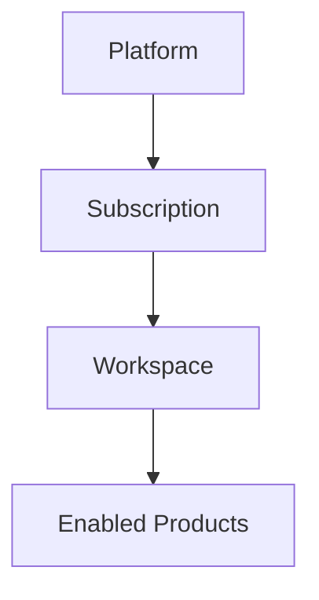
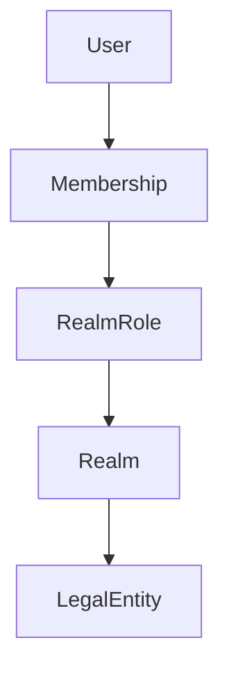
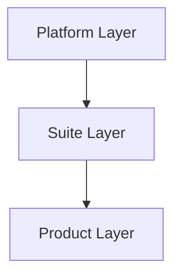
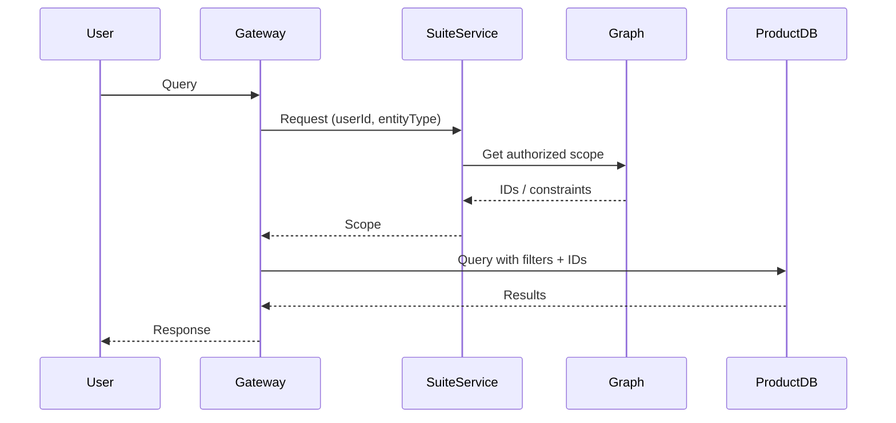
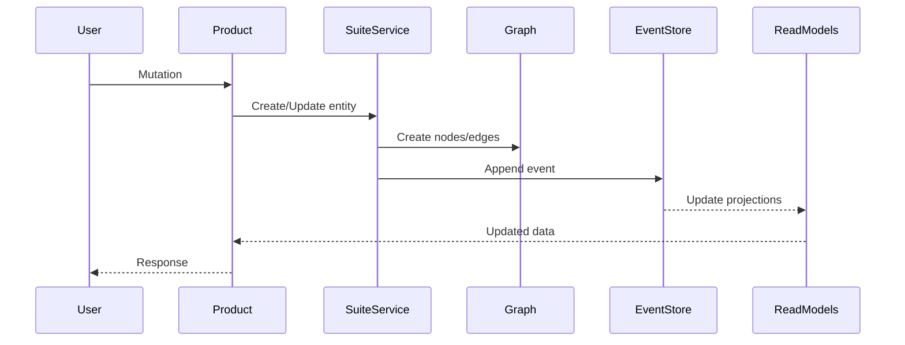
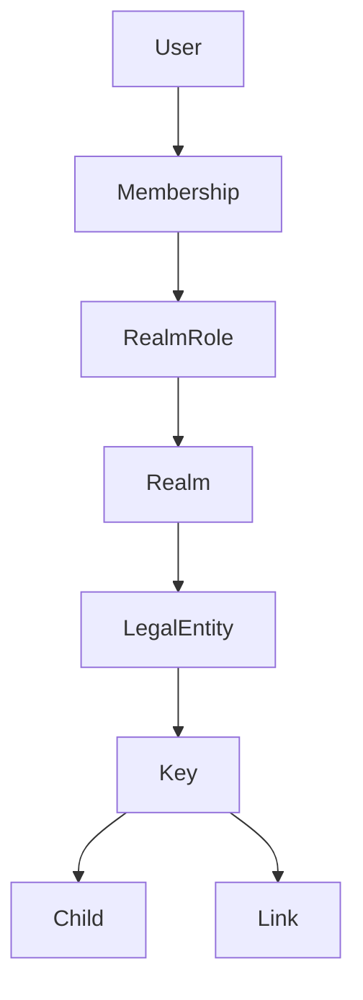
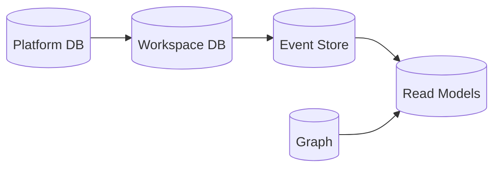

## The Brief

The platform hosts a Suite of Products. It is a multi-tenant, white-label service where subscribers can choose which products they want to subscribe to.

A subscriber purchases a **Subscription**, which provisions a **Workspace**. The Workspace is a tenant-scoped runtime environment with its own custom URL and branding.

Within a Workspace, the subscriber can:

* Enable products
* Invite and manage users
* Onboard and manage their clients (represented as LegalEntities)
* Control access to data and functionality

The platform is responsible for:

* Subscription management
* Workspace provisioning
* Identity
* Graph-based access control

The Workspace is responsible for:

* Hosting products
* Executing business logic
* Managing relationships and access via the graph

### Business Overview

---

## Definitions

### Platform

The global system responsible for identity, subscription management, workspace provisioning, and graph infrastructure.

### Subscription

A platform-level commercial entitlement.
Each Subscription provisions exactly one Workspace.

### Workspace

A tenant-scoped runtime environment created for a Subscription.
This is the boundary for all business data and access control.

### Suite

A shared schema and contract layer that defines:

* Shared entity types
* Shared domain rules
* Suite Services for entity creation and invariants

### Product

A module that provides business functionality.
Products extend the Suite Schema and operate within a Workspace.

### Platform Services

* Identity
* Subscription
* Graph

### Suite Services

* Shared domain logic
* Entity creation
* Invariants enforcement

### LegalEntity

A real-world person or organization.

Rules:

* A LegalEntity may exist without a User
* A User may be associated with one or more LegalEntities
* A company LegalEntity may have multiple Users acting within its Realm

### User

A system identity used for authentication and interaction.

### Realm

A workspace-scoped access boundary owned by a LegalEntity.

### RealmRole

Defines permissions and traversable paths within a Realm.

### Membership

Links a User to a RealmRole within a Realm.

### Actor Model

---

## Architecture Rules

* A Workspace is the tenant boundary
* Each Subscription provisions exactly one Workspace
* All business entities are Workspace-scoped
* Products do not call each other directly
* Products write via Suite Services
* Products synchronize via event streams
* Products read from:

  * Product Read Models (product-specific)
  * Suite Read Models (shared)
* Event Store is the source of truth
* Graph is the relationship and authorization index
* Read tables are projections only
* Graph access is only through Platform Services
* All shared entities must be created via Suite Services

### Layered Architecture

---

## Implications

* There is a **Suite Schema** defining shared entity contracts
* Product Schemas extend the Suite Schema with product-specific types
* All shared entities are created through Suite Services
* Products interact only via:

  * Suite Services (write)
  * Event streams (sync)
  * Read models (read)
* The system must support modular frontend composition
* A single Gateway API is used
* A single frontend application exposes all products
* Platform layer exists above the Suite for:

  * User management
  * Subscription management
  * Workspace provisioning
* Workspaces are isolated (initial strategy: schema-per-workspace)

---

## Complications

* Need full auditability
* Need to support easy addition of new products
* Subscriber must have full authority within their Workspace
* Access control must support:

  * Complex relationships
  * Delegation to client entities
  * Clear reasoning of "who can see what and why"

---

## Execution Model

### Query Flow

---

### Mutation Flow

---

## Solution

### Frontend

* Single Blazor application (Auto render mode: SSR + WASM)
* Uses BFF pattern
* Products provide Razor Class Libraries (RCLs)
* Dynamic component loading for product UI
* Gateway API determines:

  * user context
  * accessible products

---

### Identity

* Keycloak
* JWT-based authentication

---

### Access Control

* Relationship-Based Access Control (ReBAC)
* Implemented via graph (Postgres + AGE)

#### Graph Model

#### Rules:

* Graph per Workspace
* Subscriber has full access
* Realms owned by LegalEntities
* Roles define permissions and traversable paths

---

### Gateway

* GraphQL (HotChocolate)
* Aggregates platform + suite + product schemas

---

### Suite Services

* Create shared entities
* Enforce invariants
* Generate IDs
* Call Platform Services (graph)

---

### Products

* Contain business logic and UI
* Extend schema
* Use Gateway for all API calls

---

### Persistence Model

* Event Store = source of truth
* Graph = relationships + permissions
* Read Models = projections

---

## Schema

### Platform Scoped

* Platform User
* Subscription

---

### Workspace Scoped

* User
* LegalEntity
* Realm
* RealmRole
* Membership

---

### Tagging

* TagDefinition
* TagOption
* Tag

---

### Suite Domain Base Types

* Key (Aggregate root)
* Child (dependent entity)
* Link (relationship entity)

---

## Data Ownership

| Layer       | Owns                                         |
| ----------- | -------------------------------------------- |
| Platform    | Users, Subscriptions, Workspace provisioning |
| Suite       | Shared entities, invariants, IDs             |
| Product     | Business logic, projections, UI              |
| Graph       | Relationships, access control                |
| Event Store | Source of truth                              |

---

## Notes

* Platform handles provisioning and identity
* Workspace handles runtime business logic
* Graph enforces access control
* Products operate within strict boundaries
