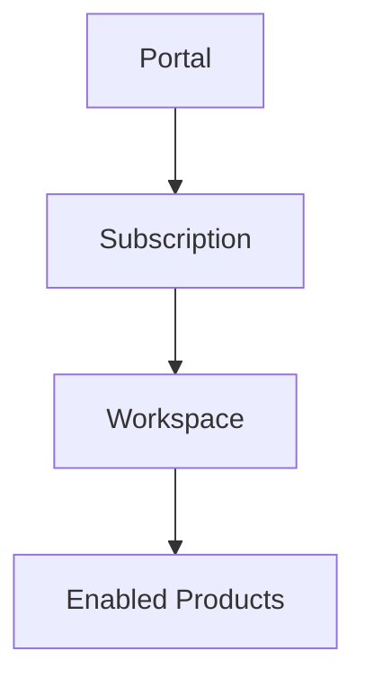
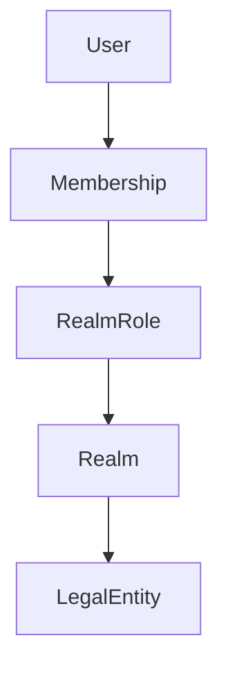
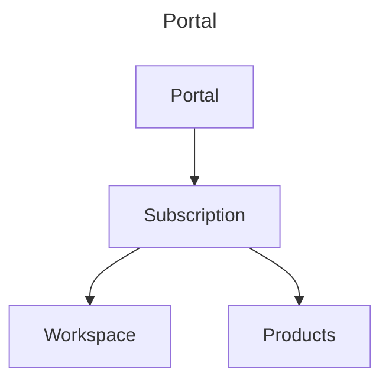
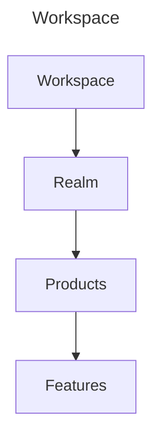
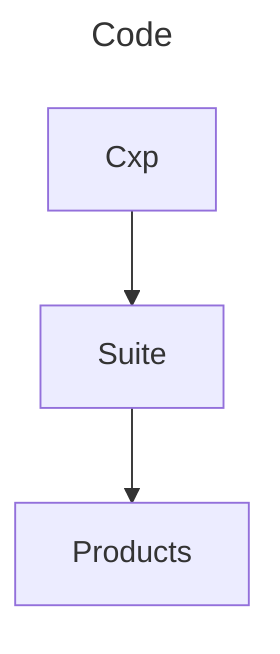
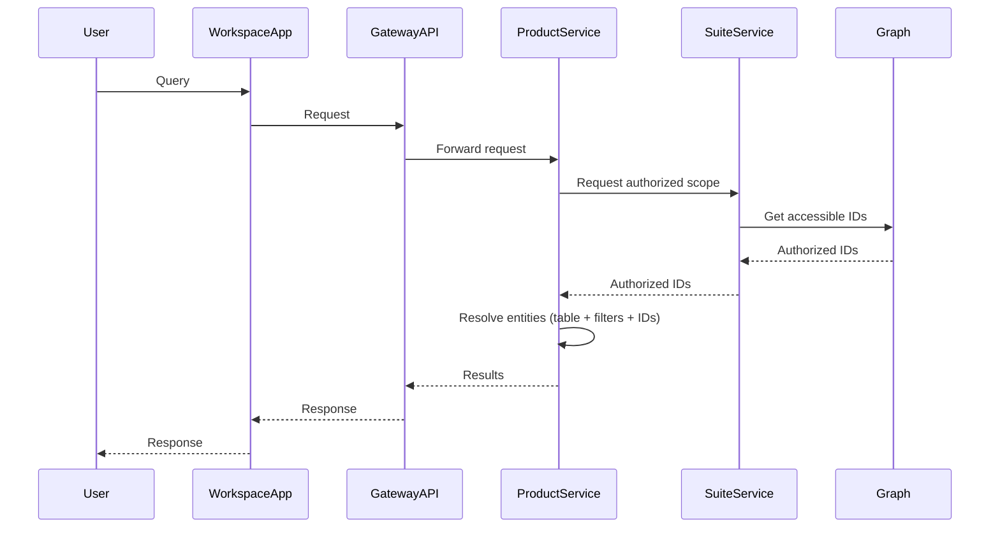
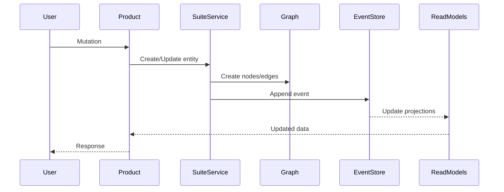
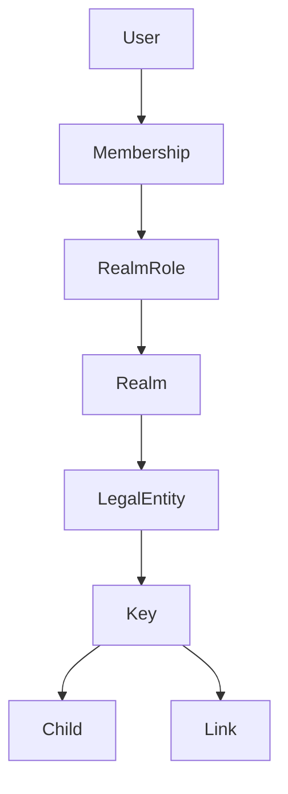
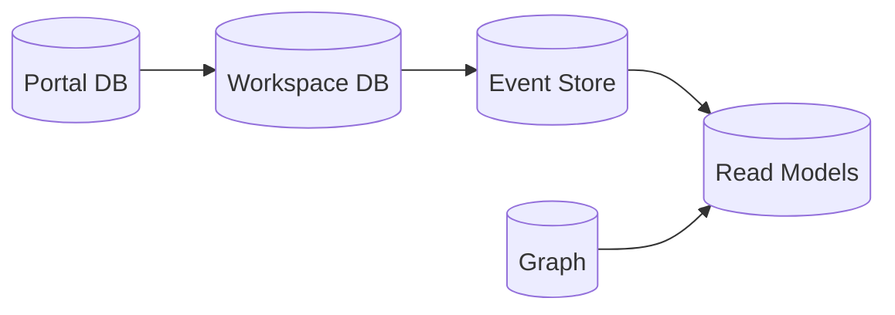

---

title: ""
date: 2026-04-23
----------------

## The Brief

The system hosts a Suite of Products. It is a multi-tenant, white-label service where subscribers can choose which products they want to subscribe to.

A subscriber purchases a **Subscription**, which provisions a **Workspace**. The Workspace is a tenant-scoped runtime environment with its own custom URL and branding.

There are two primary applications:

* **Portal** (`utilityconnect.io`) – used for subscription, onboarding, and management
* **Workspace** (`utilityconnect.io/{workspace}`) – tenant runtime where products are used

Within a Workspace, the subscriber can:

* Enable products
* Invite and manage users
* Onboard and manage their clients (represented as LegalEntities)
* Control access to data and functionality

The system is built on the **Connect Platform (CXP)** which provides shared infrastructure independent of the Suite domain.

---

### Business Overview

---

## Definitions

### Portal

The public and administrative application responsible for:

* Subscription management
* Workspace provisioning
* Billing and onboarding

### Subscription

A commercial entitlement managed in the Portal.
Each Subscription provisions exactly one Workspace.

### Workspace

A tenant-scoped runtime environment created from a Subscription.
This is the boundary for all business data and access control.

### Connect Platform (CXP)

The shared infrastructure layer that provides:

* Identity
* Graph services
* Provisioning
* Core abstractions

CXP is independent of the Suite business domain.

### Suite

A shared schema and contract layer that defines:

* Shared entity types
* Shared domain rules
* Suite Services for entity creation and invariants

### Product

A module that provides business functionality.
Products extend the Suite Schema and operate within a Workspace.

### LegalEntity

A real-world person or organization.

Rules:

* A LegalEntity may exist without a User
* A User may be associated with one or more LegalEntities
* A company LegalEntity may have multiple Users acting within its Realm

### User

A system identity used for authentication and interaction.

### Realm

A workspace-scoped access boundary owned by a LegalEntity.

### RealmRole

Defines permissions and traversable paths within a Realm.

### Membership

Links a User to a RealmRole within a Realm.

---

### Actor Model

---

## Architecture Rules

* A Workspace is the tenant boundary
* Each Subscription provisions exactly one Workspace
* All business entities are Workspace-scoped
* Products do not call each other directly
* Products write via Suite Services
* Products synchronize via event streams
* Products read from:

  * Product Read Models (product-specific)
  * Suite Read Models (shared)
* Event Store is the source of truth
* Graph is the relationship and authorization index
* Read tables are projections only
* Graph access is only through CXP services
* All shared entities must be created via Suite Services

---

### Layered Architecture

---

---

---

---

## Implications

* There is a **Suite Schema** defining shared entity contracts
* Product Schemas extend the Suite Schema with product-specific types
* All shared entities are created through Suite Services
* Products interact only via:

  * Suite Services (write)
  * Event streams (sync)
  * Read models (read)
* The system must support modular frontend composition
* A single Workspace Gateway API is used
* Portal and Workspace are separate applications
* Workspaces are isolated (initial strategy: schema-per-workspace)

---

## Complications

* Need full auditability
* Need to support easy addition of new products
* Subscriber must have full authority within their Workspace
* Access control must support:

  * Complex relationships
  * Delegation to client entities
  * Clear reasoning of "who can see what and why"

---

## Execution Model

### Query Flow

---

### Mutation Flow

---

## Solution

### Frontend

#### Portal

* Handles subscription and onboarding
* Manages workspace provisioning

#### Workspace App

* Hosts products
* Executes business logic
* Uses Gateway API for all operations

---

### Identity

* Managed via CXP
* Keycloak integration
* JWT-based authentication

---

### Access Control

* Relationship-Based Access Control (ReBAC)
* Implemented via graph (Postgres + AGE)

#### Graph Model

---

### Gateway

* GraphQL (HotChocolate)
* Lives in Workspace layer
* Aggregates suite + product schemas

---

### Suite Services

* Create shared entities
* Enforce invariants
* Generate IDs
* Call CXP services

---

### Products

* Contain business logic and UI
* Extend schema
* Use Gateway for all API calls

---

### Persistence Model

* Event Store = source of truth
* Graph = relationships + permissions
* Read Models = projections

---

## Schema

### Portal Scoped

* Platform User
* Subscription

---

### Workspace Scoped

* User
* LegalEntity
* Realm
* RealmRole
* Membership

---

### Tagging

* TagDefinition
* TagOption
* Tag

---

### Suite Domain Base Types

* Key (Aggregate root)
* Child (dependent entity)
* Link (relationship entity)

---

## Data Ownership

| Layer       | Owns                               |
| ----------- | ---------------------------------- |
| Portal      | Users, Subscriptions, provisioning |
| Suite       | Shared entities, invariants, IDs   |
| Product     | Business logic, projections, UI    |
| Graph       | Relationships, access control      |
| Event Store | Source of truth                    |

---

## Notes

* Portal handles onboarding and subscription
* Workspace handles runtime operations
* CXP provides shared infrastructure
* Graph enforces access control
* Products operate within strict boundaries
